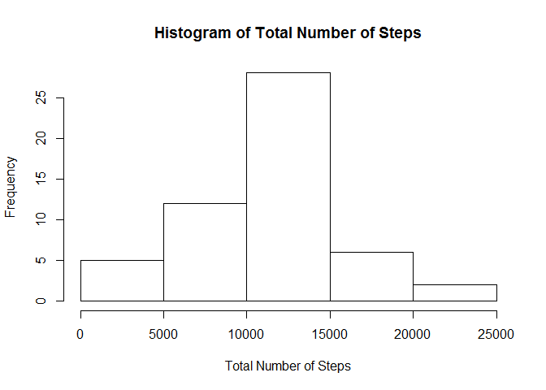
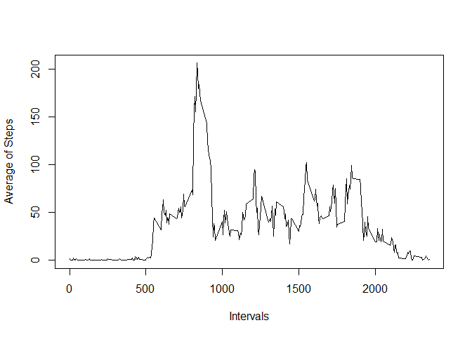
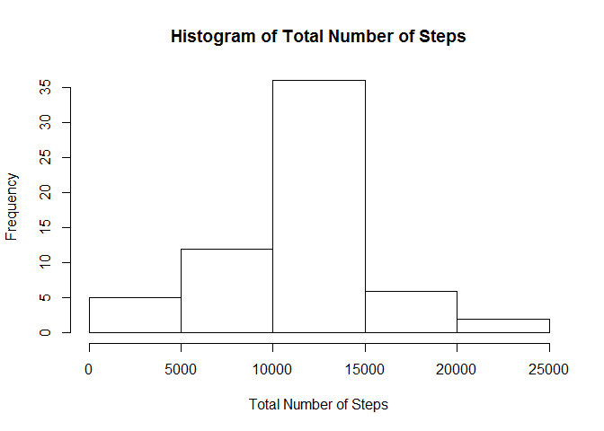
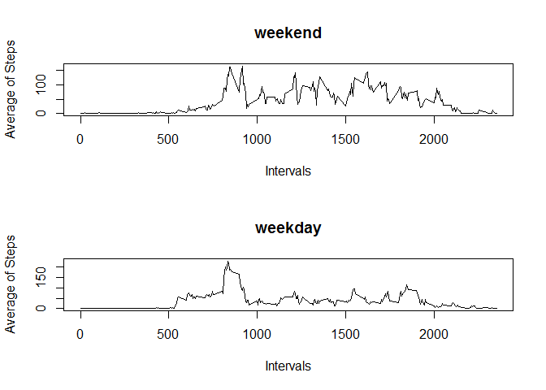

# Reproducible Research: Peer Assessment 1


## Loading and preprocessing the data

```r
# extract data
data<- read.csv(unz("activity.zip", "activity.csv"))
# clean date field
data$date<- as.Date(data$date,"%Y-%m-%d")
#create clean dataset
dataClean<-data[!is.na(data$steps),]
```


## What is mean total number of steps taken per day?

```r
# sum steps for each day
dataSteps<- aggregate(steps ~ date, data = dataClean, FUN = "sum")
#create histogram
hist(dataSteps$steps, xlab="Total Number of Steps", main="Histogram of Total Number of Steps")
```

 

```r
#calculate mean
mean(dataSteps$steps)
```

```
## [1] 10766.19
```

```r
#calculate median
median(dataSteps$steps)
```

```
## [1] 10765
```

## What is the average daily activity pattern?

```r
#avg steps for each interval
dataMean<- aggregate(steps ~ interval, data=dataClean, FUN="mean")
# line plot of avg steps per interval
plot(dataMean$interval, dataMean$steps, type = "l", xlab = "Intervals", ylab = "Average of Steps");
```

 

```r
#get inverval of max steps
dataMean[dataMean[,2]==max(dataMean$steps),]$interval
```

```
## [1] 835
```

## Imputing missing values

```r
# Count missing values
na.total <- length(which(is.na(data$steps) == TRUE))

# Add the Mean for each interval to intervals with missing data

data2 <- data
subsKey <- match(data2[is.na(data2), "interval"], dataMean$interval)
data2[is.na(data2), "steps"] <- dataMean[subsKey, "steps"]
# sum steps for each day
dataSteps2<- aggregate(steps ~ date, data = data2, FUN = "sum")
# create histogrm
hist(dataSteps2$steps, xlab="Total Number of Steps", main="Histogram of Total Number of Steps")
```

 

```r
# calculate mean
mean(dataSteps2$steps)
```

```
## [1] 10766.19
```

```r
#calculate median
median(dataSteps2$steps)
```

```
## [1] 10766.19
```
## Are there differences in activity patterns between weekdays and weekends?

```r
# get day of week
data2$day<- weekdays(data2$date)
# calculate weekends
weekEnd <- data2$day == "Sunday" | data2$day == "Saturday"
# Assign Weekday or Weekend to data
data2[!weekEnd, 4]<- "weekday"
data2[weekEnd, 4]<- "weekend"
# create dataset for each
dataWE<- data2[data2$day=="weekend",]
dataWD<- data2[data2$day=="weekday",]
#create panel plot with 2 plots
par(mfrow = c(2,1))

#calculate average steps for weekend
dataMeanWE<- aggregate(steps ~ interval, data=dataWE, FUN="mean")
# plot weekend
plot(dataMeanWE$interval, dataMeanWE$steps, type = "l", xlab = "Intervals", ylab = "Average of Steps", main="weekend");
# calculate average steps for weekday
dataMeanWD<- aggregate(steps ~ interval, data=dataWD, FUN="mean")
# plot weekday
plot(dataMeanWD$interval, dataMeanWD$steps, type = "l", xlab = "Intervals", ylab = "Average of Steps", main="weekday");
```

 

